# 🚀 Raspberry Pi 5 (16GB) LLM Arena

> **A Comprehensive Benchmark & Architecture Arena for Edge LLM Inference on Raspberry Pi 5 (16GB RAM)**

[-C51A4A?logo=raspberrypi&logoColor=white)](https://www.raspberrypi.com/products/raspberry-pi-5/)
[%2064--bit-A81D33?logo=debian&logoColor=white)](https://www.debian.org/)
[](#-三大推論架構深度對比-architecture-comparison)
[](#-基準測試排行榜-benchmark-leaderboard)

---

## 🏆 基準測試排行榜 (Benchmark Leaderboard)

### 🥇 Plan 1: Native Ollama (ARM64 REST API 標準化評測)
透過 Native Ollama HTTP REST API 進行全自動真實對話多輪提示詞基準測試：

| 排名<br><sub>(Rank)</sub> | 評測模型<br><sub>(Model)</sub> | 參數量<br><sub>(Params)</sub> | 生成速度<br><sub>(Gen TPS)</sub> | 提示詞速度<br><sub>(Prompt TPS)</sub> | 首字延遲<br><sub>(TTFT)</sub> | 峰值溫度<br><sub>(Peak Temp)</sub> | 記憶體<br><sub>(RAM)</sub> | 獨立報告<br><sub>(Report)</sub> |
| :---: | :--- | :---: | :---: | :---: | :---: | :---: | :---: | :---: |
| 🥇 **冠軍** | `deepseek-r1:1.5b` | 1.5B | **11.54 tok/s** | 183.09 tok/s | **0.243s** | 56.5°C | 1.84 GB | [📄 1.5B 報告](./benchmark/reports/deepseek-r1_1_5b_REPORT.md) |
| 🥈 **亞軍** | `gemma4:e2b` | 2.6B | **7.61 tok/s** | 99.16 tok/s | **0.585s** | 58.2°C | 8.55 GB | [📄 Gemma4 2B 報告](./benchmark/reports/gemma4_e2b_REPORT.md) |
| 🥉 **季軍** | `qwen2.5:3b` | 3B | **6.02 tok/s** | 178.39 tok/s | **0.661s** | 56.5°C | 2.87 GB | [📄 Qwen 3B 報告](./benchmark/reports/qwen2_5_3b_REPORT.md) |
| **#4** | `llama3.2:3b` | 3B | **5.92 tok/s** | 164.10 tok/s | **0.629s** | 56.5°C | 3.39 GB | [📄 Llama 3B 報告](./benchmark/reports/llama3_2_3b_REPORT.md) |
| **#5** | `gemma4:e4b` | 4.3B | **3.71 tok/s** | 47.74 tok/s | **1.243s** | 57.1°C | 10.25 GB | [📄 Gemma4 4B 報告](./benchmark/reports/gemma4_e4b_REPORT.md) |
| **#6** | `qwen2.5-coder:7b` | 7B | **2.77 tok/s** | 80.20 tok/s | **1.744s** | 58.2°C | 5.23 GB | [📄 Coder 7B 報告](./benchmark/reports/qwen2_5-coder_7b_REPORT.md) |
| **#7** | `olmo2:7b` | 7B | **2.73 tok/s** | 94.08 tok/s | **1.549s** | 57.6°C | 12.37 GB | [📄 OLMo2 7B 報告](./benchmark/reports/olmo2_7b_REPORT.md) |
| **#8** | `olmo-3:7b` | 7B | **2.56 tok/s** | 51.90 tok/s | **3.436s** | 56.5°C | 13.05 GB | [📄 OLMo-3 7B 報告](./benchmark/reports/olmo-3_7b_REPORT.md) |
| **#9** | `deepseek-r1:7b` | 7B | **2.53 tok/s** | 38.29 tok/s | **1.384s** | 57.1°C | 5.23 GB | [📄 R1 7B 報告](./benchmark/reports/deepseek-r1_7b_REPORT.md) |
| **#10** | `llama3.1:8b` | 8B | **2.46 tok/s** | 46.62 tok/s | **1.620s** | 57.6°C | 5.76 GB | [📄 Llama 8B 報告](./benchmark/reports/llama3_1_8b_REPORT.md) |

> 📊 **Plan 1 完整統整評測報告 (Master Report):** 詳見 [PLAN1_FINAL_REPORT.md](./benchmark/reports/PLAN1_FINAL_REPORT.md) 與 [plan1.md](./plan1.md)。

---

### 🥈 Plan 2: Native llama.cpp (ARMv8.2-a DotProd / FP16 向量加速)
在 **Raspberry Pi 5 (BCM2712 4-Core Cortex-A76 @ 2.40 GHz, 16GB LPDDR4X)** 上啟用 `-mcpu=cortex-a76 -march=armv8.2-a+fp16+dotprod` 原生極限微基準壓測 (`llama-bench`)：

| 排名<br><sub>(Rank)</sub> | 評測模型<br><sub>(Model Tag)</sub> | 參數量 / 檔案<br><sub>(Params / Size)</sub> | 生成速度<br><sub>(Gen TPS)</sub> | 提示詞處理<br><sub>(Prefill TPS)</sub> | 峰值溫度<br><sub>(Peak Temp)</sub> | 實體記憶體<br><sub>(Peak RAM)</sub> | 獨立報告<br><sub>(Report)</sub> |
| :---: | :--- | :--- | :---: | :---: | :---: | :---: | :---: |
| 🥇 **冠軍** | `deepseek-r1:1.5b` | 1.78B (1.04 GB) | **12.02 tok/s** | **60.66 tok/s** | 57.1°C | **0.59 GiB** | [📄 1.5B 報告](./benchmark/reports/plan2_deepseek-r1_1_5b_REPORT.md) |
| 🥈 **亞軍** | `gemma4:e2b` | 2.6B (6.67 GB) | **7.04 tok/s** | **45.44 tok/s** | 58.2°C | **3.20 GiB** | [📄 Gemma4 2B 報告](./benchmark/reports/plan2_gemma4_e2b_REPORT.md) |
| 🥉 **季軍** | `qwen2.5:3b` | 3.09B (1.80 GB) | **6.01 tok/s** | **28.89 tok/s** | 56.5°C | **0.60 GiB** | [📄 Qwen 3B 報告](./benchmark/reports/plan2_qwen2_5_3b_REPORT.md) |
| **#4** | `llama3.2:3b` | 3.21B (1.88 GB) | **5.71 tok/s** | **27.23 tok/s** | 57.6°C | **0.62 GiB** | [📄 Llama 3B 報告](./benchmark/reports/plan2_llama3_2_3b_REPORT.md) |
| **#5** | `gemma4:e4b` | 4.3B (8.95 GB) | **3.68 tok/s** | **22.50 tok/s** | 62.1°C | **5.80 GiB** | [📄 Gemma4 4B 報告](./benchmark/reports/plan2_gemma4_e4b_REPORT.md) |
| **#6** | `qwen2.5-coder:7b` | 7.61B (4.36 GB) | **2.76 tok/s** | **11.59 tok/s** | 58.2°C | **0.46 GiB** | [📄 Coder 7B 報告](./benchmark/reports/plan2_qwen2_5-coder_7b_REPORT.md) |
| **#7** | `deepseek-r1:7b` | 7.61B (4.36 GB) | **2.70 tok/s** | **11.30 tok/s** | 58.7°C | **0.44 GiB** | [📄 R1 7B 報告](./benchmark/reports/plan2_deepseek-r1_7b_REPORT.md) |
| **#8** | `olmo2:7b` | 7.05B (4.16 GB) | **2.59 tok/s** | **11.59 tok/s** | 58.7°C | **6.37 GiB** | [📄 OLMo2 報告](./benchmark/reports/PLAN2_FINAL_REPORT.md) |
| **#9** | `llama3.1:8b` | 8.03B (4.58 GB) | **2.46 tok/s** | **10.69 tok/s** | 57.6°C | **0.43 GiB** | [📄 Llama 8B 報告](./benchmark/reports/plan2_llama3_1_8b_REPORT.md) |
| **#10** | `olmo-3:7b` | 6.95B (4.16 GB) | **2.37 tok/s** | **13.90 tok/s** | 65.3°C | **8.90 GiB** | [📄 OLMo-3 報告](./benchmark/reports/plan2_olmo-3_7b_REPORT.md) |

> 📊 **Plan 2 完整統整評測報告 (Master Report):** 詳見 [PLAN2_FINAL_REPORT.md](./benchmark/reports/PLAN2_FINAL_REPORT.md) 與 [plan2.md](./plan2.md)。

---

### 🥉 Plan 3: 10 大模型邊緣極限優化與調優前後實測 (Optimization Benchmark)
針對 ARM Cortex-A76 四核進行 **全核心鎖頻 2.40 GHz (Performance Governor)**、**Modelfile 4k 上下文邊界約束 (Context Bounding)**、**4-Thread 物理核心 1:1 鎖定 (Core Pinning)** 及 **任務專項採樣超參數對齊** 前後的真實量化基準對比（單次生成標準化 150 Tokens）：

#### 📊 優化前後核心性能全景對比總表 (Comprehensive Performance Matrix)

| 序號 | 模型名稱<br><sub>(Model Tag)</sub> | 參數量<br><sub>(Params)</sub> | 輸入解析速度 (Prompt tok/s)<br><sub>優化前 $\to$ **優化後 (增幅)**</sub> | 生成吞吐量 (Eval tok/s)<br><sub>優化前 $\to$ **優化後 (增幅)**</sub> | 首次冷啟動時長 (Cold Load)<br><sub>優化前 $\to$ **優化後 (減幅)**</sub> | 實體可用記憶體<br><sub>(Free RAM)</sub> | 峰值溫度<br><sub>(Peak Temp)</sub> | 獨立評測報告<br><sub>(Report)</sub> |
| :---: | :--- | :---: | :---: | :---: | :---: | :---: | :---: | :--- |
| **01** | **`deepseek-r1:1.5b-opt`** | 1.77B | 69.50 $\to$ **73.44 (+5.7%)** | 11.96 $\to$ **12.08 tok/s** | 30.9s $\to$ **17.1s (-44.7%)** | **14.28 GB** | 57.1°C | [📄 1.5B 報告](./paper/10_optimization_report_deepseek_r1_1.5b.md) |
| **02** | **`gemma4:e2b-opt`** | 2.2B Text | 44.01 $\to$ **46.73 tok/s** | 7.24 $\to$ **7.64 tok/s (+5.5%)** | 60.6s $\to$ **28.8s (-52.5%)** | 12.65 GB | 55.4°C | [📄 Gemma4 2B 報告](./paper/09_optimization_report_gemma4_e2b.md) |
| **03** | **`qwen2.5:3b-opt`** | 3.09B | 34.78 $\to$ **35.27 tok/s (繁中對齊)** | 5.79 $\to$ **6.01 tok/s (+3.8%)** | 60.6s $\to$ **35.1s (-42.1%)** | **13.27 GB** | 51.0°C | [📄 Qwen 3B 報告](./paper/08_optimization_report_qwen2.5_3b.md) |
| **04** | **`llama3.2:3b-opt`** | 3.21B | 33.58 $\to$ **35.16 tok/s (英文極速)** | 5.94 $\to$ **5.94 tok/s** | 59.8s $\to$ **34.5s (-42.3%)** | 12.81 GB | 57.1°C | [📄 Llama 3B 報告](./paper/07_optimization_report_llama3.2_3b.md) |
| **05** | **`gemma4:e4b-opt`** | ~4.2B | 20.95 $\to$ **22.76 tok/s (+8.6%)** | 3.86 $\to$ **3.90 tok/s** | 103.2s $\to$ **53.5s (-48.2%)** | 10.92 GB | 54.9°C | [📄 Gemma4 4B 報告](./paper/06_optimization_report_gemma4_e4b.md) |
| **06** | **`deepseek-r1:7b-opt`** | 7.61B | 11.44 $\to$ **13.22 tok/s (+15.6%)** | 2.64 $\to$ **2.78 tok/s (+5.3%)** | 125.3s $\to$ **72.7s (-42.0%)** | 10.82 GB | 56.5°C | [📄 R1 7B 報告](./paper/02_optimization_report_deepseek_r1_7b.md) |
| **07** | **`qwen2.5-coder:7b-opt`**| 7.61B | 11.36 $\to$ **13.05 tok/s (+14.9%)** | 2.65 $\to$ **2.78 tok/s (+4.9%)** | 129.3s $\to$ **76.8s (-40.6%)** | 10.81 GB | 57.1°C | [📄 Coder 7B 報告](./paper/03_optimization_report_qwen2.5_coder_7b.md) |
| **08** | **`olmo2:7b-opt`** | 7.03B | 13.77 $\to$ **14.55 tok/s (+5.7%)** | 2.64 $\to$ **2.76 tok/s (+4.5%)** | 130.2s $\to$ **78.5s (-39.7%)** | 9.21 GB | 54.3°C | [📄 OLMo2 7B 報告](./paper/05_optimization_report_olmo2_7b.md) |
| **09** | **`olmo-3:7b-opt`** | 7.20B | 12.69 $\to$ **13.69 tok/s (+7.9%)** | 2.56 $\to$ **2.75 tok/s (+7.4%)** | 134.8s $\to$ **83.3s (-38.2%)** | 9.18 GB | 57.6°C | [📄 OLMo-3 7B 報告](./paper/04_optimization_report_olmo3_7b.md) |
| **10** | **`llama3.1:8b-opt`** | 8.03B | 11.28 $\to$ **12.21 tok/s (+8.2%)** | 2.40 $\to$ **2.61 tok/s (+8.8%)** | 4k 上下文邊界防抖 | 10.29 GB | 55.4°C | [📄 Llama 8B 報告](./paper/01_optimization_report_llama3.1_8b.md) |

#### 📈 四大維度優化量化收益深度剖析 (Deep-Dive Gains Analysis)
1. **輸入處理 (Prompt / TTFT) 提速顯著：**
   - 平均提速達 **+5% ~ +15.6%**。`deepseek-r1:7b` 躍升至 **13.22 tok/s**，`deepseek-r1:1.5b` 達到驚人的 **73.44 tok/s**，大幅消除前端對話等待首字時間。
2. **冷啟動初次初始化時長腰斬 (-38% ~ -52.5%)：**
   - 原始模型預設分配高達 32k ~ 131k 超長預留視窗，造成龐大記憶體映射初始化耗時。
   - 透過 Modelfile 約束 **4096 (4k) Context** 後，7B 模型冷啟動耗時自 130s 大幅降至 **72s ~ 83s (淨省 50 秒以上)**；2.2B 模型自 60s 降至 **28.8s (-52.5%)**。
3. **穩定生成吞吐率 (Throughput) 逼近硬體物理極限：**
   - 7B/8B 旗艦全數穩定運行於 **2.60 ~ 2.78 tok/s**（逼近 Pi 5 雙通道 LPDDR4X 17 GB/s 頻寬極限）。
   - 3B 模型達到 **5.90 ~ 6.01 tok/s**（即時流式交談流暢體驗）。
   - 1.5B/2.2B 模型達到 **7.64 ~ 12.08 tok/s**（邊緣秒級推理）。
4. **超充沛記憶體餘裕與完美熱控：**
   - 運行 7B/8B 時系統實體剩餘 RAM 仍高達 **9.2 ~ 10.8 GB**；運行 3B 時剩餘 **12.8 ~ 13.2 GB**；運行 1.5B 時剩餘高達 **14.28 GB**。
   - 鎖頻 2.40 GHz 高負載連續推論下，最高溫僅 **51.0°C ~ 57.6°C**，`vcgencmd get_throttled` 全程 `0x0`（零降頻、零電壓不穩）。

```
                        [ Raspberry Pi 5 邊緣模型推論生成吞吐率 (Tokens/Sec) ]

  1.5B 微型思考模型   [==================================================] 12.08 tok/s  (deepseek-r1:1.5b-opt)
  2.2B 剪枝多模態     [===============================] 7.64 tok/s                     (gemma4:e2b-opt)
  3.1B 繁中旗艦       [========================] 6.01 tok/s                            (qwen2.5:3b-opt)
  3.2B 英文剪枝       [========================] 5.94 tok/s                            (llama3.2:3b-opt)
  4.2B 原生多模態     [================] 3.90 tok/s                                    (gemma4:e4b-opt)
  7.6B 代碼旗艦       [===========] 2.78 tok/s                                         (qwen2.5-coder:7b-opt)
  7.6B 深度推理       [===========] 2.78 tok/s                                         (deepseek-r1:7b-opt)
  7.0B 完全開放       [===========] 2.76 tok/s                                         (olmo2:7b-opt)
  7.2B 溯源推理       [===========] 2.75 tok/s                                         (olmo-3:7b-opt)
  8.0B 旗艦基底       [==========] 2.61 tok/s                                          (llama3.1:8b-opt)
                      0         2         4         6         8         10        12 (tok/s)
```

> 📊 **優化前後全維度量化深度對比總表 (Master Comparison):** 詳見 [optimization_comparison_table.md](./paper/optimization_comparison_table.md)。  
> 📑 **10 大模型論文研讀與選型指南專區 (Paper Compendium):** 詳見 [paper/README.md](./paper/README.md) 與 [10_models_comparison_matrix.md](./paper/10_models_comparison_matrix.md)。  
> 🛠️ **模型極限調優工程手冊 (Optimization Guide):** 詳見 [model_optimization_guide.md](./paper/model_optimization_guide.md)。


---

## ⚡ 核心發現與三大架構對比 (Architecture Comparison)



| 評估維度<br><sub>(Dimension)</sub> | Native llama.cpp<br><sub>(DotProd Accelerated)</sub> | Native Ollama<br><sub>(Host Service)</sub> | Dockerized Ollama<br><sub>(Container)</sub> |

```mermaid
graph TD
    subgraph Architecture 1: Native llama.cpp
        A1[Native CLI / llama-bench] -->|ARM NEON / DotProd ASM| B1[Linux Kernel & CPU Registers]
    end

    subgraph Architecture 2: Native Ollama
        A2[REST API :11434] -->|Go Daemon / IPC| B2[llama.cpp Runner]
        B2 -->|ARM NEON Vector Ops| C2[Linux Kernel & CPU Registers]
    end

    subgraph Architecture 3: Dockerized Ollama
        A3[Port Forwarding :11434] -->|OverlayFS / cgroups| B3[Ollama Container]
        B3 -->|IPC| C3[llama.cpp Runner]
        C3 -->|Virtualization Overhead| D3[Linux Kernel & CPU Registers]
    end
```

| :--- | :--- | :--- | :--- |
| **推論生成吞吐量 (TPS)** | **極致最高 (100% 物理極限)** | **極高 (~95% - 98%)** | 中高 (~88% - 93%) |
| **記憶體額外開銷 (RAM Overhead)** | **0 MB (純 POSIX mmap 映射)** | ~30 MB (Go Runtime) | ~200 MB (Containerd + OverlayFS) |
| **模型管理便利度 (DX)** | 手動下載 / 需指定 Blob 路徑 | **一鍵 `ollama pull`** | 一鍵 `ollama pull` |
| **硬體感測器整合 (Telemetry)** | **原生完全支援 (`vcgencmd`)** | **原生完全支援 (`vcgencmd`)** | 需高風險 `--privileged` 提權 |
| **長文本 Prefill 運算加速** | **ARMv8.2-a DotProd 向量極致** | 依賴動態載入動態函式庫 | 依賴動態載入動態函式庫 |

---

## 📂 專案結構 (Repository Structure)

```text
pi5-llm-arena/
├── README.md                           # 專案首頁與三階段極限評測 Leaderboard
├── plan1.md                            # Plan 1 實施計畫書與評測報告彙整
├── plan1_cmd.md                        # Plan 1 完整指令集、工作流與問題排除手冊
├── plan2.md                            # Plan 2 實施計畫書與三大架構深度剖析
├── plan2_cmd.md                        # Plan 2 原生編譯 llama.cpp 與 DotProd 壓測手冊
├── requirements.txt                    # Python 相依套件
├── paper/                              # 📚 10 大模型論文研讀、優化比較大表與實測報告庫
│   ├── README.md                       # 論文研讀與選型指南總覽
│   ├── 10_models_comparison_matrix.md  # 規格/機制/數據/特性 四維深度橫向比較矩陣
│   ├── optimization_comparison_table.md# ⚡ 優化前後全維度量化實測對比大表 (Plan 3)
│   ├── model_optimization_guide.md     # 五大工程極限調優手段指引
│   ├── 01_gemma4_e4b.md ~ 10_...       # 10 份個別技術論文深度剖析文件
│   └── 01_optimization_report_...      # 10 份調優前後實測評測量化報告
├── code_dispatcher/                    # 🚀 FastAPI + Redis Queue 非同步任務調度閘道
│   ├── main.py                         # RESTful API 與硬體遙測端點
│   ├── tasks.py                        # RQ 背景推論 Worker 任務
│   └── ui.html                         # 即時 Web 聊天與代碼審查介面
├── benchmark/

│   ├── benchmark_suite.py              # Plan 1 全自動評測套件 (測量 TTFT, TPS, 溫度, RAM)
│   ├── analyze_results.py              # Plan 1 統計彙整分析器
│   ├── plan2_benchmark_suite.py        # Plan 2 遠端調度微基準測試套件
│   ├── pi5_plan2_local_runner.py       # Plan 2 Pi 5 本地守護壓測進程 (Zero-Jitter)
│   ├── plan2_analyze_results.py        # Plan 2 雙引擎交叉對比報告產生器
│   ├── logs/                           # Plan 1 原始對話 Log 與指標
│   ├── logs_plan2/                     # Plan 2 llama-bench 原始微基準 Log
│   ├── reports/                        # Markdown 評測報告集散庫
│   │   ├── deepseek-r1_1_5b_REPORT.md
│   │   ├── plan2_deepseek-r1_1_5b_REPORT.md
│   │   ├── ...
│   │   ├── PLAN1_FINAL_REPORT.md       # Plan 1 最終主報告
│   │   └── PLAN2_FINAL_REPORT.md       # Plan 2 最終主報告
│   └── results/
│       ├── master_benchmark_summary.json
│       └── plan2_benchmark_summary.json
```

---

## 🛠️ 重現評測步驟 (How to Reproduce)

### 1. 執行 Plan 1 (Native Ollama 評測)
```bash
python benchmark/benchmark_suite.py
python benchmark/analyze_results.py
```

### 2. 執行 Plan 2 (Native llama.cpp 評測)
```bash
# 在 Pi 5 上編譯 Native llama.cpp
cmake -B build -G Ninja -DGGML_CPU_AARCH64=ON -DCMAKE_C_FLAGS="-mcpu=cortex-a76 -O3 -march=armv8.2-a+fp16+dotprod"
cmake --build build --config Release -j4 --target llama-bench

# 執行本地基準壓測並產出報告
python3 benchmark/pi5_plan2_local_runner.py
python3 benchmark/plan2_analyze_results.py
```
