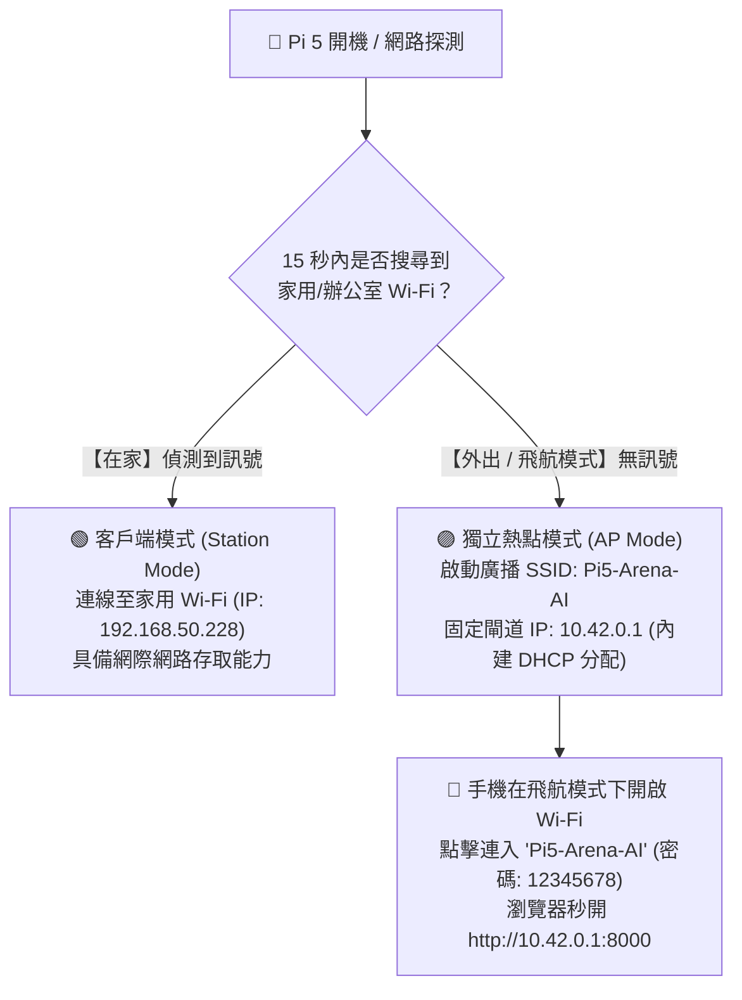

# 📱 樹莓派 5 行動邊緣熱點手冊 (Mobile AP & Airplane Mode Architecture)

> **目標：** 實現全場景適應（包含**飛航模式 Airplane Mode** 與**完全離網環境**）。平時自動連線家用 Wi-Fi，外出或離網時 Pi 5 自動降級為 AP 熱點，手機瀏覽器直連固定 IP (`10.42.0.1:8000`) 操作本地 AI。

---

## 1. 為什麼選擇「Pi 5 當 AP」而非「手機開熱點」？

| 比較項目 | 📱 手機開熱點 (Phone as AP) | 🍓 Pi 5 當熱點 (Pi 5 as AP) |
| :--- | :--- | :--- |
| **飛航模式相容性** | ❌ **不支援** (手機開啟飛航模式時，系統強制停用熱點功能) | ✅ **100% 完美支援** (手機飛航模式下仍可獨立開啟 Wi-Fi 連入 Pi 5) |
| **IP 位址可預測性** | 浮動未知 (每次被手機 DHCP 分配不同 IP，盲機難以查詢) | ✅ **永遠固定** (Pi 5 閘道 IP 固定為 `10.42.0.1`) |
| **連線穩定度** | 易受手機螢幕鎖定、熱點省電逾時中斷 | ✅ **硬體級持續廣播** (不受手機休眠影響) |
| **瀏覽器書籤** | 需隨 IP 變更修改或依賴 mDNS | ✅ 瀏覽器書籤永久保存 `http://10.42.0.1:8000` |

---

## 2. 智慧雙模切換架構 (Smart Auto-AP Failover)



---

## 3. 核心技術實作方式 (Implementation with NetworkManager)

Raspberry Pi 5 (Debian 13 Bookworm/Trixie) 原生採用 `NetworkManager`，無需安裝複雜的 `hostapd` 與 `dnsmasq`，直接使用原生設定：

### 步驟 1：建立 Pi 5 專屬熱點設定檔 (AP Profile)
```bash
sudo nmcli connection add type wifi ifname wlan0 con-name "Pi5-Hotspot" autoconnect no ssid "Pi5-Arena-AI"
sudo nmcli connection modify "Pi5-Hotspot" 802-11-wireless.mode ap 802-11-wireless.band bg
sudo nmcli connection modify "Pi5-Hotspot" ipv4.method shared ipv4.addresses 10.42.0.1/24
sudo nmcli connection modify "Pi5-Hotspot" wifi-sec.key-mgmt wpa-psk
sudo nmcli connection modify "Pi5-Hotspot" wifi-sec.psk "raspberrypi5"
```

### 步驟 2：手動或自動啟動熱點
- **手動切換至熱點模式 (隨時可用)：**
  ```bash
  sudo nmcli connection up "Pi5-Hotspot"
  ```
- **切回一般 Wi-Fi 模式：**
  ```bash
  sudo nmcli connection down "Pi5-Hotspot"
  sudo nmcli connection up "pre_configured_wifi"
  ```

### 步驟 3：全自動切換守護進程 (Auto-Failover Daemon)
透過一個簡單的 systemd 服務或 NetworkManager 聯動腳本：
- 若開機 20 秒內連不上任何已知 Wi-Fi，自動執行 `nmcli connection up "Pi5-Hotspot"`！
- 偵測到已知 Wi-Fi 出現時，自動切回家用網路。

---

## 4. 手機端連線體驗注意事項 (Mobile UX)

1. **無網際網路提示 (No Internet Warning)：**
   - 手機在飛航模式連上 `Pi5-Arena-AI` 時，系統彈窗提示「此 Wi-Fi 沒有網際網路連線」，此為正常現象。
   - 請點選 **「保持 Wi-Fi 連線」** 或 **「不使用行動數據」**。
2. **極速訪問：**
   - 手機 Safari / Chrome 輸入：
     ```text
     http://10.42.0.1:8000
     ```
   - 即可在飛機上、高鐵上、地下室完全離線使用 Pi 5 上的大模型對話與語音服務！

---

## 5. 手機 Web App (PWA) 極致體驗整合

若要將網頁體驗升級為如原生 App 般順暢：

### 5.1 什麼是 PWA (Progressive Web App)？
透過在 Web Server 加入 `manifest.json` 與 `sw.js` (Service Worker)：
- **iPhone / iPad:** Safari 開啟網頁 $\to$ 點擊分享按鈕 $\to$ 選擇 **「加入主畫面 (Add to Home Screen)」**。
- **Android:** Chrome 開啟網頁 $\to$ 點擊選單 $\to$ 選擇 **「安裝應用程式 (Install App)」**。
- **效果：** 手機桌面產生獨立「Pi 5 AI」App 圖示，啟動時**無瀏覽器網址列、無上下導航列**，以全螢幕原生體驗運行。

### 5.2 麥克風語音輸入規範 (Web Audio HTTPS)
- 若希望在 Web App 內**直接按住麥克風說話**：
  - 手機瀏覽器強制要求安全上下文 (Secure Context)。
  - 在 Pi 5 上啟用自簽 HTTPS 憑證 (如 `https://10.42.0.1:8443`)，手機首次信任後即可獲得無限制的 Web 麥克風錄音權限。

---

## 6. STA + AP 雙工並發模式 (同時連 Wi-Fi 又開熱點)

Pi 5 硬體晶片 (BCM43455) 支援 `#{ managed } <= 1, #{ AP } <= 1`，可**單網卡同時實現連網與廣播熱點**：

### 6.1 雙網段配置範例
- **對外網卡介面 (`wlan0`):** Station 模式，連線家中路由器，獲取 `192.168.50.228` (可對外聯網)。
- **熱點虛擬介面 (`uap0`):** AP 模式，固定 IP 閘道 `10.20.0.1` (自帶 DHCP 配發 `10.20.0.100~200` 給手機)。

### 6.2 方案 A 實測限制警語 (Firmware Crash Risk)
- **實體晶片與驅動限制：**
  樹莓派 5 內建 Wi-Fi 晶片 (CYW43455) 雖在 `iw list` 報告支援 `managed <= 1, AP <= 1`，但官方 Linux 核心 `brcmfmac` 驅動程式並未完善虛擬雙工。實測在 `wlan0` 已連線時執行 `ip link set uap0 up`，會引發無線韌體崩潰 (Firmware Lockup) 導致中斷。
- **解決路徑：**
  - **若必須 100% 真正的「物理同時連 Wi-Fi + 同時開 AP」：** 採用**方案 B (外接迷你 USB Wi-Fi 網卡)**，雙實體射頻各自獨立，徹底免除驅動衝突。
  - **若在單晶片下追求最高穩定度與無外網支援：** 採用**方案 C (智慧故障轉移切換 Auto-Failover + Web 手動切換)**，以標準 NetworkManager 切換 `wlan0` 身份，最穩健可靠。

---

## 7. 方案 C：智慧故障轉移切換 (Auto-AP Failover) 實作規格

### 7.1 熱點 Profile 規格 (`nmcli`)
- **連線名稱 (Connection Name):** `Pi5-Hotspot`
- **SSID:** `raspi543_AI`
- **密碼 (WPA-PSK):** `raspi543`
- **無線頻段 (Band):** 2.4GHz / 5GHz (`bg` 或 `a`)
- **IPv4 模式:** `shared` (由 NetworkManager 內建 dnsmasq 提供 DHCP/DNS)
- **固定閘道 IP:** `10.20.0.1/24`
- **DHCP 配發範圍:** `10.20.0.100` ~ `10.20.0.254`

### 7.2 智慧守護進程 (Failover Daemon: `pi5-auto-failover.service`)
```mermaid
graph TD
    A[開機初始化] --> B{檢查家用 Wi-Fi 是否在線?}
    B -- 是 (在家) --> C[保持連線 My_5G_Guest1]
    C --> D[每 15 秒 Ping 外部閘道]
    D -- 正常 --> C
    D -- 連續 3 次失敗 (斷網/外出) --> E[切換至 Pi5-Hotspot (10.20.0.1)]
    B -- 否 (戶外/飛航模式) --> E
    E --> F[廣播熱點 raspi543_AI]
    F --> G{背景掃描家用 Wi-Fi 是否出現?}
    G -- 發現可用訊號 --> H[切換回 My_5G_Guest1]
    H --> C
    G -- 無可用訊號 --> F
```

### 7.3 Web API 控制介面 (FastAPI - Port 80 預設)
在 `code_dispatcher` 後端採用 `AmbientCapabilities=CAP_NET_BIND_SERVICE` 原生監聽 **Port 80**：
- **獨立熱點連線網址：** `http://10.20.0.1` (免輸入 `:8000`)
- **家用 Wi-Fi 連線網址：** `http://192.168.50.228` (免輸入 `:8000`)
- 提供以下管理端點：
1. `GET /api/network/status`
   - 回傳格式：
     ```json
     {
       "mode": "sta", // 或 "ap"
       "active_connection": "My_5G_Guest1",
       "ip_address": "192.168.50.228",
       "hotspot_ip": "10.20.0.1",
       "gateway_status": "online"
     }
     ```
### 7.4 Telegram 遠端控制指令
在 Telegram Bot 中已新增獨立熱點切換指令：
- **指令觸發：** 發送 `/hotspot`、`/ap` 或 `/hotspot_a`
- **自然語言觸發：** 在對話中說「切換熱點」、「開熱點」或「切到方案A」
- **執行行為：**
  1. Telegram Bot 會先發送確認回覆與熱點連線指南 (`raspi543_AI` / `10.20.0.1`)。
  2. 延遲 1.5 秒確保訊息送出後，背景自動執行 `sudo nmcli connection up Pi5-Hotspot` 切換為 AP 熱點模式。
  3. 使用者手機搜尋連線 `raspi543_AI` 後，即可造訪 `http://10.20.0.1` 繼續離線 AI 推論。
  4. 需恢復外網時，在 Web 頁面頂部點擊「切換回家用 Wi-Fi」即可重新喚醒 Telegram Bot。


