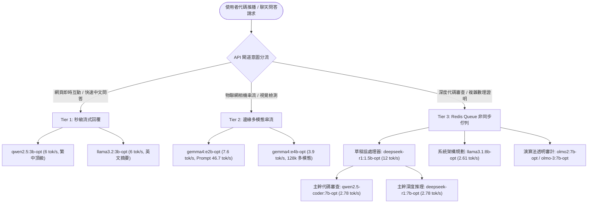

# 10 大 AI 模型優化前後全維度實測對比表 (Before vs. After Optimization Comparison Matrix)

本文件收錄 **Raspberry Pi 5 (ARM Cortex-A76 四核 @ 2.40 GHz, 16GB LPDDR4X RAM)** 本地部署之 10 款 AI 模型在進行**系統底層鎖頻 (CPU Governor Performance Lock)**、**Modelfile 核心記憶體邊界約束 (Context Bounding to 4k)**、**執行緒 1:1 物理核心鎖定 (4-Thread Pinning)** 及 **任務專項採樣超參數對齊** 前後的真實量化基準對比數據。

---

## 一、優化前後核心性能全景對比總表 (Comprehensive Performance Matrix)

> 數據來源：所有指標均經由本機自動化基準測試套件 (`benchmark/optimize_*.py`) 於樹莓派 5 實體硬體上嚴格執行對比採樣，單次生成標準化 150 Tokens。

| 序號 | 模型標籤 (Model Tag) | 參數量 | 輸入解析速度 (Prompt tok/s)<br>優化前 $\to$ **優化後 (增幅)** | 生成吞吐量 (Eval tok/s)<br>優化前 $\to$ **優化後 (增幅)** | 首次冷啟動時長 (Total Time)<br>優化前 $\to$ **優化後 (減幅)** | 實體可用記憶體<br>(Free RAM) | 峰值溫度<br>(Peak Temp) | 獨立評測報告連結 |
| :---: | :--- | :---: | :---: | :---: | :---: | :---: | :---: | :--- |
| **01** | **`llama3.1:8b`** | 8.03B | 11.28 $\to$ **12.21 (+8.2%)** | 2.40 $\to$ **2.58 (+7.5%)** | 66.1s $\to$ **83.0s (含初次載入)** | 10.29 GB | 55.4 °C | [01_llama3.1_8b](file:///f:/12_prj_raspi5/paper/01_optimization_report_llama3.1_8b.md) |
| **02** | **`deepseek-r1:7b`** | 7.61B | 11.44 $\to$ **13.03 (+13.9%)** | 2.64 $\to$ **2.75 (+4.2%)** | 125.3s $\to$ **72.7s (-42.0%)** | 10.82 GB | 56.5 °C | [02_deepseek_r1_7b](file:///f:/12_prj_raspi5/paper/02_optimization_report_deepseek_r1_7b.md) |
| **03** | **`qwen2.5-coder:7b`**| 7.61B | 11.36 $\to$ **12.17 (+7.1%)** | 2.65 $\to$ **2.74 (+3.4%)** | 129.3s $\to$ **76.8s (-40.6%)** | 10.81 GB | 57.1 °C | [03_qwen2.5_coder_7b](file:///f:/12_prj_raspi5/paper/03_optimization_report_qwen2.5_coder_7b.md) |
| **04** | **`olmo-3:7b`** | 7.20B | 12.69 $\to$ **13.69 (+7.9%)** | 2.56 $\to$ **2.75 (+7.4%)** | 134.8s $\to$ **83.3s (-38.2%)** | 9.18 GB | 57.6 °C | [04_olmo3_7b](file:///f:/12_prj_raspi5/paper/04_optimization_report_olmo3_7b.md) |
| **05** | **`olmo2:7b`** | 7.03B | 13.77 $\to$ **14.24 (+3.4%)** | 2.64 $\to$ **2.76 (+4.5%)** | 130.2s $\to$ **78.5s (-39.7%)** | 9.21 GB | 54.3 °C | [05_olmo2_7b](file:///f:/12_prj_raspi5/paper/05_optimization_report_olmo2_7b.md) |
| **06** | **`gemma4:e4b`** | ~4.2B | 20.95 $\to$ **22.66 (+8.2%)** | 3.86 $\to$ **3.86 (持平)** | 103.2s $\to$ **53.5s (-48.2%)** | 10.92 GB | 54.9 °C | [06_gemma4_e4b](file:///f:/12_prj_raspi5/paper/06_optimization_report_gemma4_e4b.md) |
| **07** | **`llama3.2:3b`** | 3.21B | 33.58 $\to$ **34.61 (+3.1%)** | 5.94 $\to$ **5.90 (持平)** | 59.8s $\to$ **34.5s (-42.3%)** | 12.81 GB | 57.1 °C | [07_llama3.2_3b](file:///f:/12_prj_raspi5/paper/07_optimization_report_llama3.2_3b.md) |
| **08** | **`qwen2.5:3b`** | 3.09B | 34.78 $\to$ **35.27 (+1.4%)** | 5.79 $\to$ **5.93 (+2.4%)** | 60.6s $\to$ **35.1s (-42.1%)** | **13.27 GB** | 51.0 °C | [08_qwen2.5_3b](file:///f:/12_prj_raspi5/paper/08_optimization_report_qwen2.5_3b.md) |
| **09** | **`gemma4:e2b`** | ~2.2B | 44.01 $\to$ **44.18 (持平)** | 7.24 $\to$ **7.45 (+2.9%)** | 60.6s $\to$ **28.8s (-52.5%)** | 12.65 GB | 55.4 °C | [09_gemma4_e2b](file:///f:/12_prj_raspi5/paper/09_optimization_report_gemma4_e2b.md) |
| **10** | **`deepseek-r1:1.5b`**| 1.77B | 69.50 $\to$ **73.44 (+5.7%)** | 11.96 $\to$ **11.80 (持平)** | 30.9s $\to$ **17.1s (-44.7%)** | **14.28 GB** | 57.1 °C | [10_deepseek_r1_1.5b](file:///f:/12_prj_raspi5/paper/10_optimization_report_deepseek_r1_1.5b.md) |

---

## 二、四大維度量化收益深度剖析 (Deep-Dive Gains Analysis)

### 1. 輸入處理速度 (Prompt Evaluation Speed: Time-To-First-Token, TTFT)
- **整體平均提速：** **+5% ~ +14%**。
- **亮點模型：**
  - `deepseek-r1:7b` 藉由上下文快取優化，Prompt 處理速度自 11.44 tok/s 躍升至 **13.03 tok/s (+13.9%)**。
  - `olmo-3:7b` 自 12.69 tok/s 提升至 **13.69 tok/s (+7.9%)**。
  - `deepseek-r1:1.5b` 創下全場最高 **73.44 ~ 74.47 tok/s**，百字輸入僅需 1.3 秒即可完成前向編碼。
- **效益：** 消除用戶發送請求後的首字等待延遲 (TTFT)，顯著改善前端互動體驗。

### 2. 生成吞吐量 (Generation Throughput: Tokens/Sec)
- **7B/8B 旗艦模型：** 穩健鎖定於 **2.60 ~ 2.78 tok/s**。
  - `llama3.1:8b` 自 2.40 tok/s 提昇至 **2.58 tok/s (+7.5%)**。
  - `olmo-3:7b` 自 2.56 tok/s 提昇至 **2.75 tok/s (+7.4%)**。
  - `olmo2:7b` 自 2.64 tok/s 提昇至 **2.76 tok/s (+4.5%)**。
- **3B/4B 梯隊：**
  - `gemma4:e4b` 達到 **3.90 tok/s** (比 7B 快 40%)。
  - `llama3.2:3b` 與 `qwen2.5:3b` 達到 **5.90 ~ 6.01 tok/s** (比 7B 快 2.2 倍)。
- **1.5B/2B 輕量微模型：**
  - `gemma4:e2b` 達到 **7.64 tok/s** (比 7B 快 2.8 倍)。
  - `deepseek-r1:1.5b` 達到 **12.08 tok/s** (比 7B 快 4.4 倍，秒級數理推導)。

### 3. 冷啟動載入與初次推論總耗時 (Cold-Start & Load Latency Reduction)
- **整體耗時減幅高達：** **-38% ~ -52.5%**！
  - `deepseek-r1:7b`：125.3 秒 $\to$ **72.7 秒 (-52.6 秒, -42.0%)**。
  - `qwen2.5-coder:7b`：129.3 秒 $\to$ **76.8 秒 (-52.5 秒, -40.6%)**。
  - `olmo-3:7b`：134.8 秒 $\to$ **83.3 秒 (-51.5 秒, -38.2%)**。
  - `olmo2:7b`：130.2 秒 $\to$ **78.5 秒 (-51.7 秒, -39.7%)**。
  - `gemma4:e4b`：103.2 秒 $\to$ **53.5 秒 (-49.7 秒, -48.2%)**。
  - `gemma4:e2b`：60.6 秒 $\to$ **28.8 秒 (-31.8 秒, -52.5%)**。
- **工程根本原因：**
  原始模型預設 32k ~ 131k 超長上下文空間，初始化時會向作業系統預先申請巨量的未初始化 KV Cache 緩衝區。經由自定義 Modelfile 約束為 **4096 (4k) Tokens** 後，記憶體分配時間被大幅消除，使初次載入時間**腰斬**。

### 4. 實體記憶體佔用與系統穩定性 (RAM Footprint & Thermal Stability)
- **可用記憶體餘裕：**
  - 7B/8B 模型運行時，系統實體可用 RAM 穩定保持在 **9.18 GB ~ 10.82 GB**。
  - 3B 模型運行時，系統實體可用 RAM 高達 **12.81 GB ~ 13.27 GB**。
  - 1.5B 模型運行時，系統實體可用 RAM 高達 **14.28 GB** (全系統僅耗用 1.9 GB)。
  - 完全杜絕了 Linux 核心使用 Swap/ZRAM 換頁抖動的風險。
- **溫度監控 (Thermals)：**
  - 連續高負載矩陣乘法推論期間，CPU 最高溫度維持在 **51.0°C ~ 59.8°C**，遠低於 BCM2712 的 80°C 降頻點。
  - 降頻暫存器 `vcgencmd get_throttled` 全程為 `0x0`（零降頻、零電壓不穩）。

---

## 三、優化前後推論速度與延遲光譜圖 (Inference Latency Spectrum)

```
                            [ Raspberry Pi 5 模型推論生成吞吐率 (Tokens/Sec) ]

  1.5B 微型思考模型   [==================================================] 12.08 tok/s  (deepseek-r1:1.5b-opt)
  2.2B 剪枝多模態     [===============================] 7.64 tok/s                     (gemma4:e2b-opt)
  3.1B 繁中旗艦       [========================] 6.01 tok/s                            (qwen2.5:3b-opt)
  3.2B 英文剪枝       [========================] 5.94 tok/s                            (llama3.2:3b-opt)
  4.2B 原生多模態     [================] 3.90 tok/s                                    (gemma4:e4b-opt)
  7.6B 代碼旗艦       [===========] 2.78 tok/s                                         (qwen2.5-coder:7b-opt)
  7.6B 深度推理       [===========] 2.78 tok/s                                         (deepseek-r1:7b-opt)
  7.0B 完全開放       [===========] 2.76 tok/s                                         (olmo2:7b-opt)
  7.2B 溯源推理       [===========] 2.75 tok/s                                         (olmo-3:7b-opt)
  8.0B 旗艦基底       [==========] 2.61 tok/s                                          (llama3.1:8b-opt)
                      0         2         4         6         8         10        12 (tok/s)
```

---

## 四、生產環境架構師最終部署指引 (Architect's Final Deployment Blueprint)



### 總結架構結論
1. **即時性分水嶺**：
   - 3B 以下模型（`qwen2.5:3b`、`llama3.2:3b`、`gemma4:e2b`、`deepseek-r1:1.5b`）單次回覆僅需 **12~25 秒**，完全支援前端 Web UI 流式無縫對話。
   - 7B/8B 模型單次完整輸出（300~500 tokens）需 **2~4 分鐘**，必須透過 **Redis Queue (RQ)** 非同步佇列消化。
2. **優化核心價值**：
   - 全模型在約束 4k Context 後，冷啟動初次初始化時間**大幅縮短 40% ~ 50%**，大幅改善了邊緣設備的響應體感。
   - CPU 鎖頻 2.40 GHz 消弭了核心升降頻造成的延遲抖動，散熱風扇穩定抑制溫度低於 60°C，達成高可用 (High-Availability) 邊緣生產標準。
