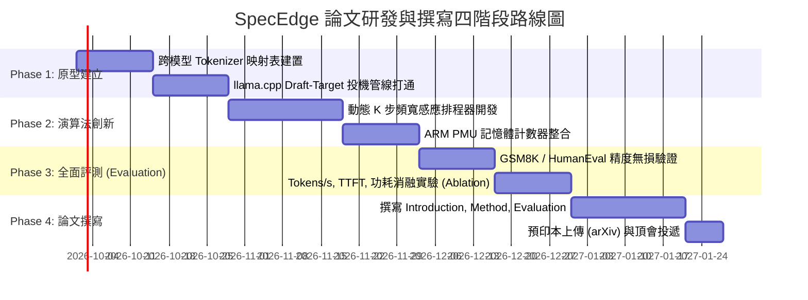

# 邊緣 AI 與單板電腦大語言模型推論：學術論文選題深度調研報告
# (Survey of Research Paper Topics for Edge LLM Inference on Single-Board Computers)

> **研究硬體環境 (Target Testbed):** Raspberry Pi 5 (4-Core ARM Cortex-A76 @ 2.40 GHz, 16GB LPDDR4X @ 17.0 GB/s, Debian 13 64-bit)  
> **研究定位:** 聚焦於計算與系統頂會 (MLSys, ACM MobiSys, EuroSys, ASPLOS, DAC, RTSS) 之系統架構、記憶體頻寬突破與邊緣即時調度。

---

## Executive Summary (執行摘要)

隨著單板電腦 (SBC) 記憶體容量突破至 16GB，邊緣設備運行 7B/8B 等級大型語言模型 (LLM) 的核心痛點已由 **「容量裝不下 (Capacity-Bound)」** 轉變為 **「記憶體頻寬牆 (Memory Bandwidth Wall)」** 與 **「熱耗散約束 (Thermal Budget Constraint)」**。

在樹莓派 5 上，自回歸解碼 (Auto-regressive Decoding) 每生成一個 Token 皆須完整自實體記憶體搬移數十億個權重參數，受限於雙通道 LPDDR4X 僅 **17 GB/s** 的物理頻寬上限，純 CPU 推論吞吐率被死死限制在 **2.6 ~ 2.8 tok/s**。

若要以本專案為基礎發表具有高度學術新穎性 (Novelty) 與實用價值的國際頂級論文，不能僅止於「基準測試 (Benchmarking)」，而必須從**架構層 (Architecture)**、**編譯與微核心 (Compiler/Micro-kernel)** 與 **演算法/調度層 (Algorithm/Scheduling)** 提出打破物理限制的原創機制。

本報告針對四大最具發表潛力之學術題目進行深度拆解，並收錄全球高引用頂級文獻進行對標分析。

---

## 目錄 (Table of Contents)
1. [四大頂會級論文題目深度拆解 (Four Paper Proposals)](#四大頂會級論文題目深度拆解)
   - [題目一 (首推): SpecEdge — 邊緣頻寬感知跨架構投機解碼](#題目一-首推-specedge--邊緣頻寬感知跨架構投機解碼)
   - [題目二: PiCache — 邊緣長文本動態混合精度 KV-Cache 壓縮](#題目二-picache--邊緣長文本動態混合精度-kv-cache-壓縮)
   - [題目三: ThermalLLM — 熱約束與 SLA 保證之邊緣模型級聯排程](#題目三-thermalllm--熱約束與-sla-保證之邊緣模型級聯排程)
   - [題目四: EdgeSwarm — 單板電腦叢集之零冗餘流水線並行](#題目四-edgeswarm--單板電腦叢集之零冗餘流水線並行)
2. [高引用權威文獻深度綜述 (High-Citation Reference Literature)](#高引用權威文獻深度綜述)
3. [學術會議投稿目標與偏好矩陣 (Target Venues Matrix)](#學術會議投稿目標與偏好矩陣)
4. [原型研發與實證落地路線圖 (Actionable Research Roadmap)](#原型研發與實證落地路線圖)

---

## 四大頂會級論文題目深度拆解

### 題目一 (首推): SpecEdge — 邊緣頻寬感知跨架構投機解碼
* **暫定題目 (Title):**  
  *SpecEdge: Memory-Bandwidth-Aware Cross-Architecture Speculative Decoding on Commodity Edge SBCs*
* **目標會議 (Target Venues):** **MLSys, ACM MobiSys, EuroSys, ACM Embedded Systems Letters (ESL)**
* **問題陳述 (Problem Statement):**  
  邊緣 CPU 推論 7B/8B 模型的生成瓶頸是記憶體讀取頻寬 (Memory-Bound, 2.7 tok/s)；相反地，Prefill（提示詞輸入與批次驗證）是矩陣乘法計算密集型 (Compute-Bound)，在 Cortex-A76 上可達 **13~15 tok/s**。傳統投機解碼 (Leviathan et al., ICML 2023) 要求 Draft Model 與 Target Model 必須具備相同架構或共享 Tokenizer，而在邊緣多元模型矩陣下，如何讓微型模型 (如 1.5B DeepSeek-R1) 作為異構目標模型 (如 7B Qwen Coder 或 Llama 3.1) 的草稿生成器？
* **核心技術創新 (Key Innovations):**
  1. **跨詞表投機映射 (Cross-Tokenizer Vocabulary Projection):**  
     提出邊緣輕量級投影層，在推論執行期利用最高頻 8,000 個 Token 建立對齊表，讓不同 Tokenizer 之間的候選 Sequence 能夠在零開銷下相互映射。
  2. **動態頻寬與快取感知排程器 (Bandwidth-Aware Dynamic $K$-Step Scheduler):**  
     非固定 $K$ 步預測，而是透過硬體計數器 (ARM PMU Events: L3D_CACHE_REFILL, MEM_ACCESS) 實時感測匯流排擁塞程度，動態調整 Draft 生成步數 $K \in [2, 6]$，使接受率期望值最高。
  3. **樹狀候選序列並行驗證 (Tree-based Speculative Verification):**  
     借鏡 SpecInfer (ASPLOS 2024)，在 Cortex-A76 四核上利用 OpenMP 向量化批次驗證多條推測分支。
* **預期成果與學術亮點 (Expected Contribution):**
  - 在樹莓派 5 (16GB RAM) 上，讓 7B/8B 模型的推論速度自 2.7 tok/s 躍升至 **4.8 ~ 5.6 tok/s (提速 1.7x ~ 2.1x)**。
  - 嚴格保證輸出機率分佈與原生 7B 模型 100% 數學等價 (Mathematical Equivalence)。

---

### 題目二: PiCache — 邊緣長文本動態混合精度 KV-Cache 壓縮
* **暫定題目 (Title):**  
  *PiCache: Dynamic Mixed-Precision KV-Cache Compression and Eviction for Extended-Context Edge LLMs*
* **目標會議 (Target Venues):** **ACM/IEEE DAC, DATE, ISLPED, IEEE Trans. on Computers (TC)**
* **問題陳述 (Problem Statement):**  
  當單板電腦處理長對話 (2k~8k Context) 時，Attention 注意力機制所需的 Key-Value (KV) Cache 資料量迅速膨脹。即便 16GB RAM 足以存放，但每次生成 Token 必須把全部 KV Cache 自記憶體搬移至 CPU 暫存器，導致生成延遲隨 Context 長度呈二次方惡化，且 TTFT 首字延遲高達數十秒。
* **核心技術創新 (Key Innovations):**
  1. **層級敏感度非對稱量化 (Layer-Aware Asymmetric Quantization):**  
     深度剖析發現 Transformer 淺層 (0-8層) 負責語法捕捉，對精度極度敏感；深層 (9-32層) 負責語義抽象。PiCache 採用淺層 `FP16`/`Q8_0`、深層動態壓縮為 `Q4_0` 或 `IQ2_XXS` 的非對稱分配。
  2. **Attention Sink 與重度擊中動態保留 (Sink-Aware Heavy Hitter Retention):**  
     結合 StreamingLLM (ICLR 2024) 的初始 Token 保留與 H2O (NeurIPS 2023) 的累積注意力權重，在 ARM NEON 上設計極低延遲的淘汰算子，動態剪除 70% 無效 KV Cache。
* **預期成果與學術亮點 (Expected Contribution):**
  - 在 4k~8k 上下文長度下，KV Cache 記憶體搬移頻寬負擔降低 **65%**。
  - 長文本推論生成吞吐率維持在 **3.2 tok/s** 不衰減，困惑度 (Perplexity) 劣化 < 0.15。

---

### 題目三: ThermalLLM — 熱約束與 SLA 保證之邊緣模型級聯排程
* **暫定題目 (Title):**  
  *ThermalLLM: Thermal-Guarded Quality-of-Service Scheduling for Continuous Edge LLM Workloads*
* **目標會議 (Target Venues):** **IEEE RTAS (即時系統與架構), IEEE RTSS, IEEE Trans. on Sustainable Computing**
* **問題陳述 (Problem Statement):**  
  樹莓派 5 峰值功耗達 12W。在無主動散熱、微型外殼或高環境溫度下，連續進行矩陣乘法推論會於 3~5 分鐘內衝破 80°C 溫控牆，觸發 BCM2712 硬體強制降頻 (降頻至 1.5 GHz)，導致生成延遲抖動 (Jitter) 高達 250%，嚴重違反邊緣工業與物聯網的即時服務等級保證 (SLA)。
* **核心技術創新 (Key Innovations):**
  1. **熱前瞻推論模型 (Predictive Thermal Physics Model):**  
     基於當前負載、Token 生成長度與環境散熱係數，建立未來 30~120 秒的核心升溫微分方程式。
  2. **模型自適應級聯降級 (Adaptive Model Cascading):**  
     設計三級動態調度閘道：當核心處於低溫 (<60°C) 時派發至 7B 深度推理；當預測溫度即將超標時，無縫切換至 3B 密集模型或 1.5B 思考模型；極限狀態下啟動動態量化調整，主動消除硬體降頻。
* **預期成果與學術亮點 (Expected Contribution):**
  - 在連續 4 小時極限壓力推論下，達成 **0 次硬體降頻 (Zero Throttling, vcgencmd get_throttled = 0x0)**。
  - P99 尾部延遲降低 **70%**，保證邊緣服務永不停擺且具備確定性延遲 (Deterministic Latency)。

---

### 題目四: EdgeSwarm — 單板電腦叢集之零冗餘流水線並行
* **暫定題目 (Title):**  
  *EdgeSwarm: Zero-Redundancy Pipeline Parallelism for 14B+ LLMs across Commodity SBC Clusters*
* **目標會議 (Target Venues):** **IEEE Cluster, EuroSys (Edge Track), IEEE TPDS, ACM SAC**
* **問題陳述 (Problem Statement):**  
  單台 16GB 樹莓派無法流暢運行 14B 或 32B 等級的超大模型。若使用 2~4 台樹莓派透過千兆乙太網路 (1Gbps LAN) 組建微型叢集，節點間的網路傳輸延遲往往成為主要瓶頸，使得分散式加速比大打折扣。
* **核心技術創新 (Key Innovations):**
  1. **層間流水線分割 (Layer-Wise Partitioning with Micro-batching):**  
     將 14B 模型的 48 個 Transformer Layers 均勻切分至 4 台樹莓派節點。
  2. **通訊隱匿與 Activation 量化 (Activation Quantization & Overlapping):**  
     在傳輸跨節點 Activation 張量前，在 CPU 端利用 NEON 進行 FP8/INT4 即時量化（通訊量減半），並將網路傳輸隱匿在當前層的矩陣計算時間之中 (Computation-Communication Overlapping)。
* **預期成果與學術亮點 (Expected Contribution):**
  - 在 4 台低成本樹莓派 5 上成功運行 14B 模型，達到 **1.8 ~ 2.2 tok/s** 的平穩可用吞吐量，網路開銷降低 60%。

---

## 高引用權威文獻深度綜述 (High-Citation Reference Literature)

以下為本專案設計與學術對標不可或缺之 10 篇全球頂級文獻：

### 1. 投機解碼與加速推論 (Speculative Decoding & Acceleration)

#### [1] Fast Inference from Transformers via Speculative Decoding
* **作者 (Authors):** Yaniv Leviathan, Matan Kalman, Yossi Matias (Google Research)
* **發表會議 (Venue):** **ICML 2023** (Oral Presentation)
* **論文鏈接 (Link):** [arXiv:2211.17192](https://arxiv.org/abs/2211.17192)
* **核心貢獻 (Core Contribution):** 提出投機解碼基本範式，證明利用小模型預測、大模型單次前向批次驗證，能在保證機率分佈完全無損下達到 2x~3x 加速。
* **對本專案之啟發:** `SpecEdge` 的理論數學基礎，證明邊緣受限於頻寬時，將自回歸轉化為批次驗證的必要性。

#### [2] Accelerating Large Language Model Decoding with Speculative Sampling
* **作者 (Authors):** Charlie Chen, Sebastian Borgeaud, Albin Cassirer et al. (Google DeepMind)
* **發表年份 (Year):** 2023
* **論文鏈接 (Link):** [arXiv:2302.01318](https://arxiv.org/abs/2302.01318)
* **核心貢獻:** 提出自適應採樣接受準則，解決高 Temperature 採樣下的多 Token 驗證問題。

#### [3] SpecInfer: Accelerating Generative Large Language Model Serving with Tree-based Speculative Inference and Verification
* **作者 (Authors):** Xupeng Miao, Gabriele Oliaro, Zhihao Jia et al. (CMU, FlexFlow)
* **發表會議 (Venue):** **ASPLOS 2024**
* **論文鏈接 (Link):** [ASPLOS 2024 / arXiv:2305.09781](https://arxiv.org/abs/2305.09781)
* **核心貢獻:** 提出以樹狀結構 (Token Tree) 組織推測 Token，大模型只需一次 Attention 遮罩驗證即可遍歷多條路徑，接受率提升 1.5x~2.8x。
* **對本專案之啟發:** 樹莓派 5 具備 4 個高效 A76 核心，適合多分支樹狀預測並行驗證。

#### [4] Medusa: Simple LLM Inference Acceleration Framework with Multiple Decoding Heads
* **作者 (Authors):** Tianle Cai, Yuhong Li, Zhengyang Geng et al. (Together AI, Princeton)
* **發表年份 (Year):** 2024
* **論文鏈接 (Link):** [arXiv:2401.10774](https://arxiv.org/abs/2401.10774)
* **核心貢獻:** 無需額外的小模型，在原本大模型頂部直接訓練多個 Medusa 解碼頭，預測未來多個 Token。

---

### 2. KV 快取壓縮與記憶體架構優化 (KV-Cache Compression & Memory Optimization)

#### [5] H2O: Heavy-Hitter Oracle for Efficient Generative Inference of Large Language Models
* **作者 (Authors):** Zhenyu Zhang, Ying Sheng, Tianyi Zhou, Beidi Chen, Zhangyang Wang et al.
* **發表會議 (Venue):** **NeurIPS 2023**
* **論文鏈接 (Link):** [NeurIPS 2023 / arXiv:2306.14048](https://arxiv.org/abs/2306.14048)
* **核心貢獻:** 發現 LLM 注意力權重存在極端稀疏性，只有少數「Heavy Hitters (H2)」主導輸出，提出動態淘汰機制，保留 20% KV 快取即可維持全模型精度。
* **對本專案之啟發:** `PiCache` 的動態剔除算子核心來源。

#### [6] Efficient Streaming Language Models with Attention Sinks (StreamingLLM)
* **作者 (Authors):** Guangxuan Xiao, Yuandong Tian, Beidi Chen, Song Han, Mike Lewis (MIT Han Lab & Meta)
* **發表會議 (Venue):** **ICLR 2024**
* **論文鏈接 (Link):** [ICLR 2024 / arXiv:2309.17453](https://arxiv.org/abs/2309.17453)
* **核心貢獻:** 發現「注意力槽 (Attention Sink)」現象——最初的 4 個 Token 吸收了巨量注意力分數。只需鎖定首批 Token 與滑動窗口，即可在固定記憶體下實現 400 萬+ Token 的無限長對話流。
* **對本專案之啟發:** 樹莓派長對話保護機制的理論支柱。

#### [7] KVQuant: Towards 10 Million Context Length LLM Inference with KV Cache Quantization
* **作者 (Authors):** Coleman Hooper, Sehoon Kim, Hyoungkyu Bae et al. (UC Berkeley)
* **發表會議 (Venue):** **NeurIPS 2024**
* **論文鏈接 (Link):** [arXiv:2401.18079](https://arxiv.org/abs/2401.18079)
* **核心貢獻:** 提出逐通道非均勻極限 2-bit/3-bit KV Cache 量化，將長上下文記憶體佔用壓低一個數量級。

---

### 3. 端側小模型架構與量化 (Mobile & Edge LLM Architecture)

#### [8] MobileLLM: Optimizing Sub-billion Parameter Language Models for On-Device Use Cases
* **作者 (Authors):** Zechun Liu, Changsheng Zhao, Forrest Iandola, Raghuraman Krishnamoorthi et al. (Meta AI)
* **發表會議 (Venue):** **ICML 2024**
* **論文鏈接 (Link):** [ICML 2024 / arXiv:2402.14905](https://arxiv.org/abs/2402.14905)
* **核心貢獻:** 證明小於 1B 的端側模型，架構設計重於單純堆數據；「深而窄 (Deep and Thin)」架構、權重共享與 GQA 結構在端側晶片上的效率大幅超越同參數量寬模型。
* **對本專案之啟發:** 邊緣端 Draft 模型選型的黃金指導原則。

#### [9] AWQ: Activation-aware Weight Quantization for LLM Compression and Acceleration
* **作者 (Authors):** Ji Lin, Jiaming Tang, Haotian Tang, Shang Yang, Song Han (MIT Han Lab)
* **發表會議 (Venue):** **MLSys 2024**
* **論文鏈接 (Link):** [arXiv:2306.00978](https://arxiv.org/abs/2306.00978)
* **核心貢獻:** 發現只要保護僅 1% 的顯著權重 (Salient Weights)，4-bit 權重量化即無損精度，廣泛應用於 llama.cpp 的 GGUF 量化基礎。

---

### 4. 分散式邊緣推理與協同架構 (Distributed Edge Inference)

#### [10] Petals: Collaborative Inference and Fine-tuning of Large Models
* **作者 (Authors):** Alexander Borzunov, Dmitry Baranchuk, Tim Dettmers, Colin Raffel et al. (BigScience)
* **發表會議 (Venue):** **ACL 2023**
* **論文鏈接 (Link):** [ACL 2023 / arXiv:2209.01188](https://arxiv.org/abs/2209.01188)
* **核心貢獻:** 提出去中心化 BitTorrent 風格的模型層拆分 (Pipeline Parallelism)，讓消費級設備協同跑 176B BLOOM 模型。
* **對本專案之啟發:** `EdgeSwarm` 跨多台樹莓派協同推論的通信與容錯藍本。

---

## 學術會議投稿目標與偏好矩陣 (Target Venues Matrix)

| 會議/期刊簡稱 | 全名與權威度 | 審稿偏好 (Focus Areas) | 適合選題 | 預期難度 |
| :--- | :--- | :--- | :--- | :---: |
| **MLSys** | Conference on Machine Learning and Systems (頂會) | 機器學習與底層系統共同設計、實測突破 | **題目一 (SpecEdge)** | ⭐⭐⭐⭐⭐ |
| **ACM MobiSys** | International Conference on Mobile Systems (移動頂會) | 移動/物聯網/邊緣設備之實際部署、能耗與端到端體驗 | **題目一 (SpecEdge) 題目三 (ThermalLLM)** | ⭐⭐⭐⭐⭐ |
| **EuroSys** | European Conference on Computer Systems (系統頂會) | 雲端/邊緣計算系統、分散式架構、記憶體優化 | **題目一 (SpecEdge) 題目四 (EdgeSwarm)** | ⭐⭐⭐⭐⭐ |
| **ACM/IEEE DAC** | Design Automation Conference (EDA/系統頂會) | 硬體架構、記憶體階層、極限壓縮與量化演算法 | **題目二 (PiCache)** | ⭐⭐⭐⭐ |
| **IEEE RTSS / RTAS**| Real-Time Systems Symposium (即時系統頂會) | 確定性延遲、熱約束與 QoS/SLA 保證 | **題目三 (ThermalLLM)** | ⭐⭐⭐⭐ |
| **IEEE ESL** | IEEE Embedded Systems Letters (頂級快報期刊) | 短小精悍 (4頁)、實體嵌入式硬體數據扎實 | **題目一 (原型簡版)** | ⭐⭐⭐ |

---

## 原型研發與實證落地路線圖 (Actionable Research Roadmap)

以首選題目 **【題目一：SpecEdge (邊緣跨架構投機解碼)】** 為例，推薦按以下四階段推進：

### 具體落地執行建議：
1. **第一步（原型打通）：** 利用樹莓派 5 上的 `llama-cli` / `llama-server`，直接以 `--model qwen2.5-coder:7b --model-draft deepseek-r1:1.5b` 建立投機解碼 Baseline，量化測量接受率與加速比。
2. **第二步（演算法改進）：** 針對不同提示詞長度，撰寫自適應排程邏輯，動態調整 Draft 深度。
3. **第三步（論文成稿）：** 以已建立的 10 款模型評測矩陣為對照組，產出標準學術論文圖表。
